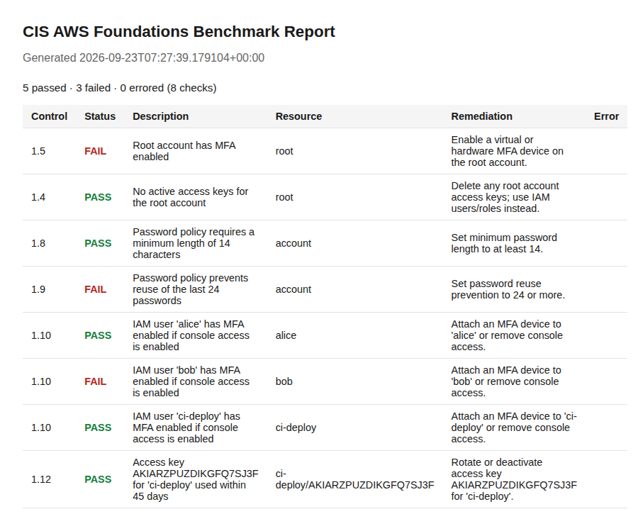

# CIS AWS Foundations Benchmark Scanner

[](https://github.com/CarlosDiegoBaes/cis-aws-scanner/actions/workflows/tests.yml)
[](LICENSE)
[](requirements.txt)

A small, read-only posture scanner that checks an AWS account against a
subset of the CIS AWS Foundations Benchmark and produces console, JSON,
and HTML reports.

This is a portfolio project focused on the blue-team / GRC / cloud
security side: it doesn't do anything offensive, it just evaluates
account configuration against known-good controls and tells you what's
out of compliance and how to fix it.

## Sample output

Run against a mocked account with a realistic mix of compliant and
non-compliant settings (`generate_sample_output.py`):



## Status: milestone 1 (IAM / CIS Section 1)

Implemented so far, pinned to **CIS AWS Foundations Benchmark v3.0.0
(2024-01-31)**, Section 1 (Identity and Access Management):

| Control | Check |
|---|---|
| 1.4 | No active access keys on the root account |
| 1.5 | Root account has MFA enabled |
| 1.8 | Password policy: minimum length 14 |
| 1.9 | Password policy: prevents reuse of last 24 passwords |
| 1.10 | MFA enabled for every IAM user with console access |
| 1.12 | Active access keys unused for 45+ days are flagged (inactive keys are skipped; a never-used key is judged by its age, not flagged automatically) |

These control IDs are pinned to v3.0.0's own numbering (verified
against the published benchmark, 2026-09), not a third party's
remapping of it. If you later target a different benchmark version,
re-verify every ID — CIS renumbers and revises this benchmark between
versions.

**Checks intentionally not implemented**, and why:
- Password composition rules (symbols/numbers/uppercase/lowercase) and
  a max password age — these existed in older benchmark versions (e.g.
  v1.2.0) but were dropped starting with later versions, in line with
  NIST 800-63B guidance against mandatory composition and periodic
  rotation. They're left out here rather than reimplemented under
  invented control IDs that don't exist in v3.0.0.
- 1.6 (hardware MFA for root), 1.7 (root usage monitoring), 1.11 (no
  access keys at initial user setup), 1.13 (only one active access key
  per user), 1.14 (access keys rotated every 90 days regardless of
  use) — real v3.0.0 controls, just not built yet. 1.14 in particular
  is a different check from 1.12: 1.12 is about keys sitting *unused*,
  1.14 is about keys getting *rotated on a schedule even while
  actively used*.

**Planned next (see the repo issues / your own roadmap):**
- S3 checks (public bucket exposure, default encryption, versioning, logging)
- CloudTrail checks (multi-region trail enabled, log file validation, encryption)
- Security group checks (no 0.0.0.0/0 on port 22/3389)
- `config.yaml` to enable/disable individual checks and scope by region

## Project structure

```
cis-aws-scanner/
├── README.md
├── LICENSE
├── .gitignore
├── .github/workflows/tests.yml   # CI: runs pytest on push/PR
├── requirements.txt
├── requirements-dev.txt
├── generate_sample_output.py     # builds sample_output/ from a mocked account
├── docs/
│   └── sample-report-screenshot.png
├── cis_aws_scanner/
│   ├── __init__.py
│   ├── models.py          # CheckStatus, CheckResult
│   ├── report.py          # ReportGenerator (console / JSON / HTML)
│   ├── scanner.py         # Scanner orchestrator + CLI entry point
│   └── checks/
│       ├── __init__.py
│       └── iam_checks.py  # IAMChecker (CIS Section 1)
├── tests/
│   └── test_iam_checks.py # moto-mocked unit tests, no real AWS needed
└── sample_output/
    ├── report.json
    └── report.html        # generated from a mocked "mixed compliance" account
```

## Setup

```bash
python -m venv .venv
source .venv/bin/activate        # Windows: .venv\Scripts\activate
pip install -r requirements-dev.txt
```

## Running the scanner

Requires AWS credentials with read-only IAM permissions (`iam:Get*`,
`iam:List*` is enough), configured the normal way (`~/.aws/credentials`,
environment variables, or an SSO profile).

```bash
python -m cis_aws_scanner.scanner --profile your-profile-name
```

This prints a console summary and writes `sample_output/report.json`
and `sample_output/report.html`. Use `--output-dir` to change where
reports are written, and `--region` to target a specific region (IAM is
a global service, but this flag matters once S3/network checks are
added).

**Least-privilege note:** run this with a read-only IAM policy, not an
admin credential. `iam:Get*` and `iam:List*` scoped to IAM resources is
sufficient for the current checks.

## Running the tests

Tests use [moto](https://github.com/getmoto/moto) to mock AWS IAM, so
they run with no real AWS account, credentials, or network access:

```bash
pytest
```

## Design notes / coding standards

This project follows the Python conventions from CSIS-252 Appendix A
(Python's Best Practices):

- **Gradual typing** — every function, method, and class attribute is
  type-hinted, including generic containers (`list[CheckResult]`,
  `dict[str, Any]`) and `Final` for constants.
- **Docstrings** — every public class and method has a multi-line
  docstring with `Parameters` / `Returns` / `Raises` sections, written
  to be pdoc-friendly.
- **Encapsulation** — internal state is stored on private attributes
  (single leading underscore) and exposed through `@property` getters
  (and `@x.setter` setters where mutation is meaningful, e.g.
  `CheckResult.status`).
- **`__str__` on every class** for readable debugging output.
- **`if __name__ == "__main__":`** guards the CLI entry point in
  `scanner.py`, with all logic in a `main()` function so the module can
  be imported and tested without running the CLI.
- **Naming** — `snake_case` for variables/methods, `ALL_CAPS` for
  module-level constants, single leading underscore for
  internal-use-only class attributes.

## Design decisions worth knowing

- **`CheckResult` separates `remediation` from `error`.** `remediation`
  is always the static "how to fix this" text; `error` only holds an
  exception message, and only when `status` is `ERROR`. That keeps a
  permissions error from literally telling you to "fix" the exception
  text instead of giving real fix-it guidance. There's also an
  `evidence` field for the raw value that drove a PASS/FAIL decision
  (e.g. `"MinimumPasswordLength=8"`), useful for showing your work in a
  report.
- **HTML output is escaped.** Every value rendered into
  `report.html` (usernames, descriptions, etc.) goes through
  `html.escape()` first, since some of that data (an IAM username, for
  instance) is technically attacker-influenceable.
- **CIS 1.12 respects key status and key age.** A key marked `Inactive`
  in IAM is skipped entirely, not flagged — it's already been
  deactivated. A key that has *never* been used is judged by how long
  it's existed (`CreateDate`), not failed automatically — a key
  created five minutes ago hasn't had a chance to be used yet.

## Extending with a new check module

1. Add `checks/s3_checks.py` (or similar) with a `<Section>Checker`
   class following the same shape as `IAMChecker`: one method per
   check returning a `CheckResult`, and a `run_all()` method.
2. Register it in `Scanner.run()` in `scanner.py`.
3. Add moto-mocked tests in `tests/test_<section>_checks.py`.
